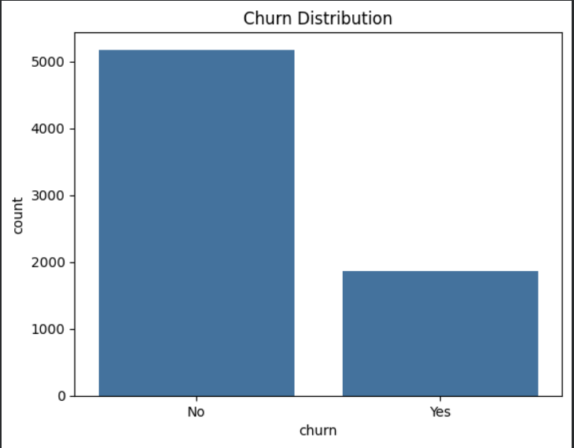
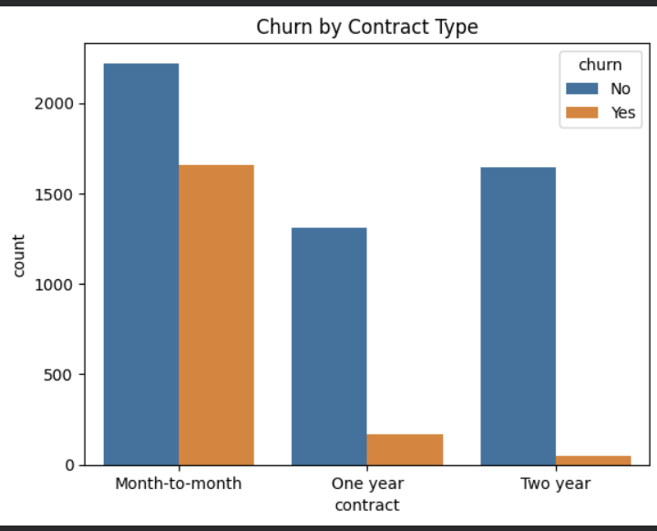
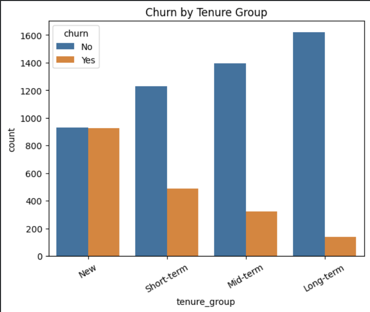
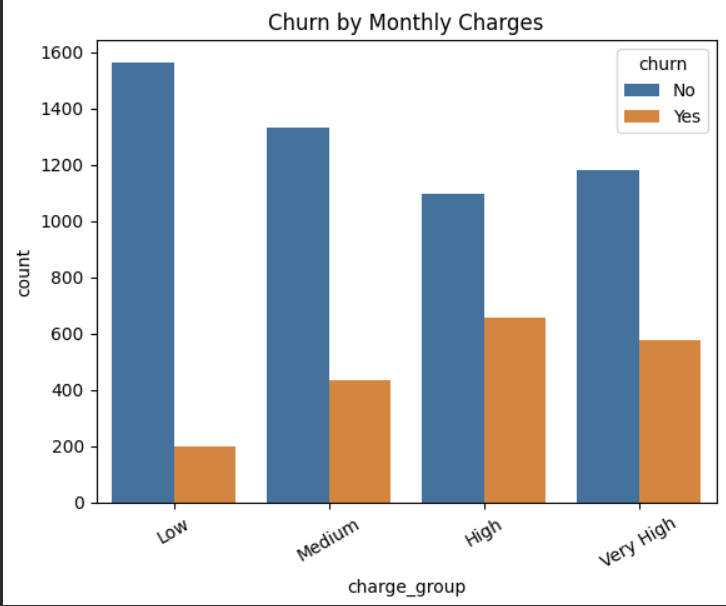
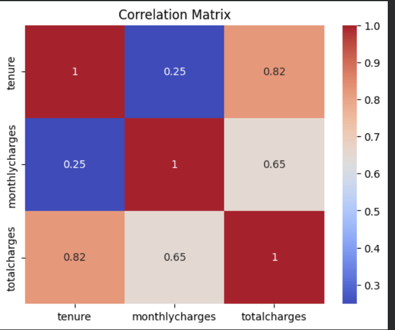

# 📊 Customer Churn Analysis (Telco Dataset)

## 🔍 Project Overview

This project focuses on analyzing customer churn behavior in a telecom company using Python-based data analytics. The goal is to identify key factors contributing to customer churn and provide actionable business insights.

Understanding churn is critical for improving customer retention and maximizing revenue. This project leverages exploratory data analysis (EDA), feature engineering, and visualization techniques to uncover meaningful patterns.

---

## 🎯 Objectives

* Analyze customer demographics and service usage
* Identify factors influencing customer churn
* Perform data cleaning and preprocessing
* Create meaningful visualizations
* Generate actionable business insights

---

## 🛠️ Tech Stack

* **Python**
* **Pandas** – Data manipulation
* **NumPy** – Numerical operations
* **Matplotlib & Seaborn** – Data visualization
* **Google Colab / Jupyter Notebook**

---

## 📁 Dataset Information

The dataset contains customer-level information including:

* Customer demographics (gender, senior citizen, dependents)
* Account information (tenure, contract type, billing)
* Services used (internet, streaming, security, etc.)
* Financial data (monthly & total charges)
* Target variable: **Churn (Yes/No)**

---

## ⚙️ Data Preprocessing

* Converted `TotalCharges` to numeric format
* Handled missing values using **group-wise median imputation**
* Standardized column names for consistency
* Created new features:

  * `tenure_group`
  * `charge_group`
  * `usage_intensity`

---

## 📊 Exploratory Data Analysis

## 📸 Project Screenshots

### 🔹 Churn Distribution



---

### 🔹 Churn by Contract Type



---

### 🔹 Churn by Tenure Group



---

### 🔹 Churn by Monthly Charges



---

### 🔹 Correlation Heatmap




### Key Analysis Performed:

* Univariate analysis (distribution of churn, contract types)
* Bivariate analysis (churn vs features)
* Feature-based segmentation
* Correlation analysis

---

## 📈 Key Visualizations

* Churn distribution
* Churn vs Contract Type
* Churn vs Tenure Group
* Churn vs Monthly Charges
* Distribution plots (charges, tenure)
* Correlation heatmap

---

## 🔥 Key Insights

* Customers with **month-to-month contracts** have the highest churn rate
* **Higher monthly charges** are strongly associated with churn
* **New customers (low tenure)** are more likely to churn
* Customers with **long-term contracts are more stable**
* Senior citizens show slightly higher churn behavior

---

## 💡 Business Recommendations

* Encourage customers to switch to **long-term contracts**
* Offer incentives for **high monthly charge users**
* Focus on **early-stage customer retention strategies**
* Improve services for high-risk churn segments

---

## 🚀 Future Enhancements

* Build machine learning models (Logistic Regression, Random Forest)
* Perform feature importance analysis
* Deploy a churn prediction system
* Create interactive dashboards (Power BI / Tableau)

---

## 📂 Project Structure

```
Customer-Churn-Analysis/
│── Customer_Churn_Analysis.ipynb
│── Customer Churn.csv
│── README.md
```

---

## 🙌 Author

**Nitish Gope**
---

## ⭐ If you found this useful

Give this repo a ⭐ and feel free to connect!
